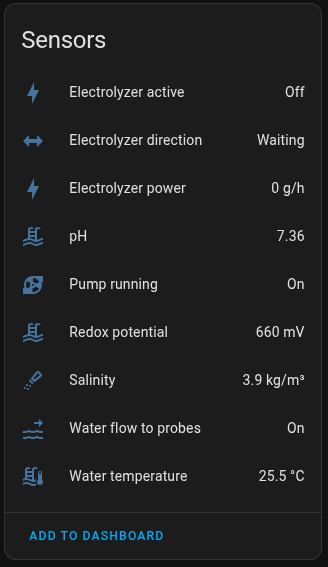
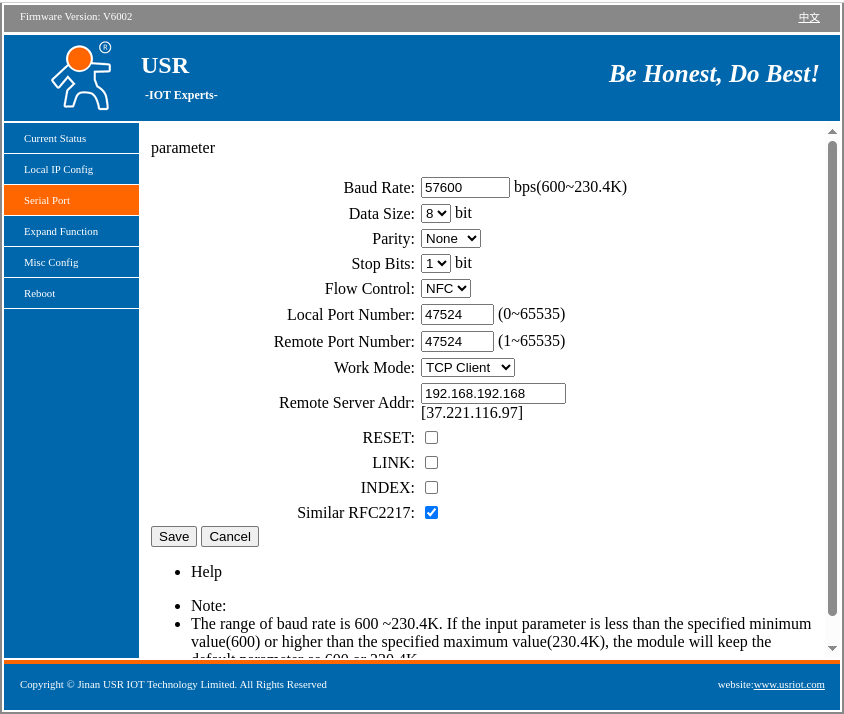
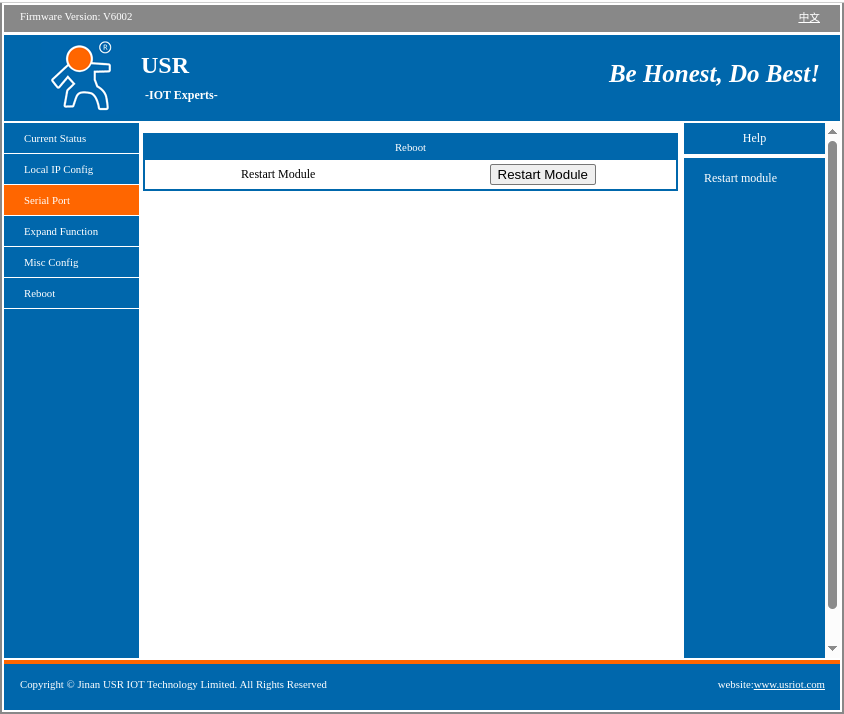

# Aseko Local

[](https://github.com/custom-components/hacs)

## Summary

Local integration for receiving data directly from **Aseko** pool unit without relying on the **[Aseko Cloud](https://aseko.cloud)**.



The Aseko unit and your Home Assistant need to run on the same network (Aseko unit needs to be able to send data to a configured port on your Home Assistant) as the integration relies on direct data stream from the unit.

## Installation

### Via HACS - recommended

Use this button to install the integration:

[](https://my.home-assistant.io/redirect/hacs_repository/?repository=aseko-local&owner=hopkins-tk)

### Manual installation

There should be no need to use this method, but this is how:

- Download the zip / tar.gz source file from the release page.
- Extract the contents of the zip / tar.gz
- In the folder of the extracted content you will find a directory 'custom_components'.
- Copy this directory into your Home-Assistant '<config>' directory so that you end up with this directory structure: '<config>/custom_components/aseko_local
- Restart Home Assistant Core

## Configure your Aseko unit

You need to re-configure your Aseko unit to send data to your Home Assistant instance.

### Aseko unit configuration

1. Access your Aseko unit IP address

   - default credentials: **admin**/**admin**

2. Go to **Serial Port** configuration

   
   You can see the default **Remote Srver Address** is **pool.aseko.com** (or something similar) - make note of that if you would like to keep sending the data there as well - see [Optional: Keep data to Aseko Cloud](#optional-keep-data-to-aseko-cloud)

3. Change **Remote Server Addr** to the IP address or DNS record of your **Home Assistant** instance on your local network (or your TCP mirror - see [Optional: Keep data to Aseko Cloud](#optional-keep-data-to-aseko-cloud))

   

4. (Optional) Change **Remote Port Number** to the port on which the integration will be listening on your **Home Assistant** instance

5. Confirm the **Restart** of the module

   

### Optional: Keep data to Aseko Cloud

If you want to keep sending the data to Aseko Cloud, you will have to ensure mirroring of the data stream to both: Aseko Cloud & your Home Assistant.

You can achieve that by introducing a TCP proxy, which will mirror the trafic to Aseko Cloud as well as your Home Assistant server - e.g. using https://github.com/mkevac/goduplicator

### Example configuration in Docker Compose

```
  goduplicator:
    container_name: goduplicator
    image: ptlange/goduplicator:latest
    command: "-l ':47524' -f 'pool.aseko.com:47524' -m '192.168.192.168:47524'"
    restart: unless-stopped
```

- `pool.aseko.com` being the original **Remote Server Addr** with port `47524` configured as **Remote Port Number** in the Aseko unit previously
- `192.168.192.168` being your **Home Assistant** server with port `47524` configured for this integration

In the Aseko unit configuration, configure IP & port of the TCP mirror instead of the Home Assistant instance as the TCP mirror will be sending the data to both Aseko Cloud & your Home Assistant instance.
